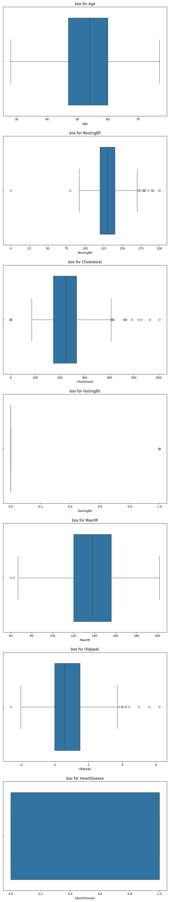
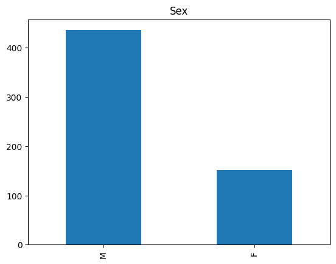
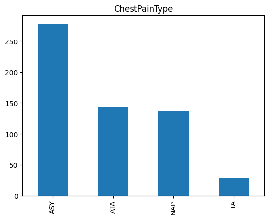
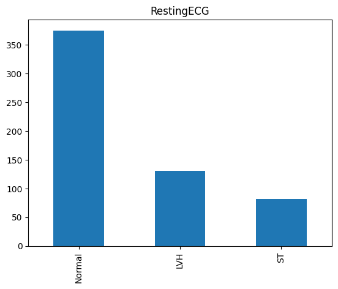
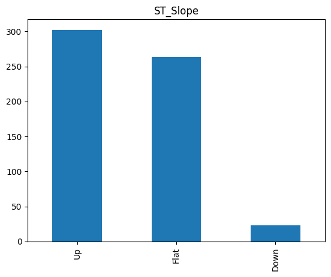
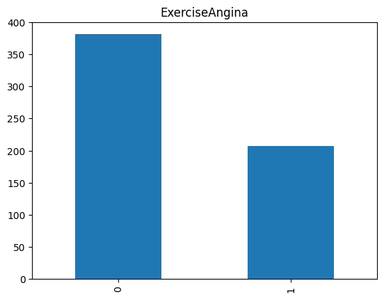
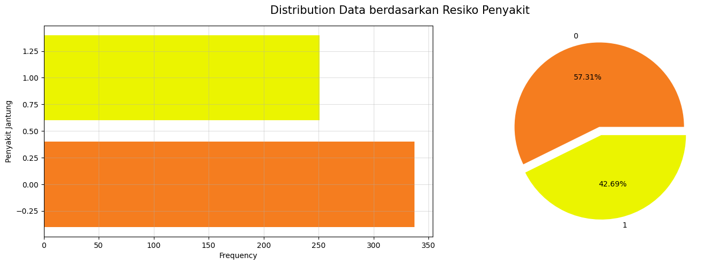
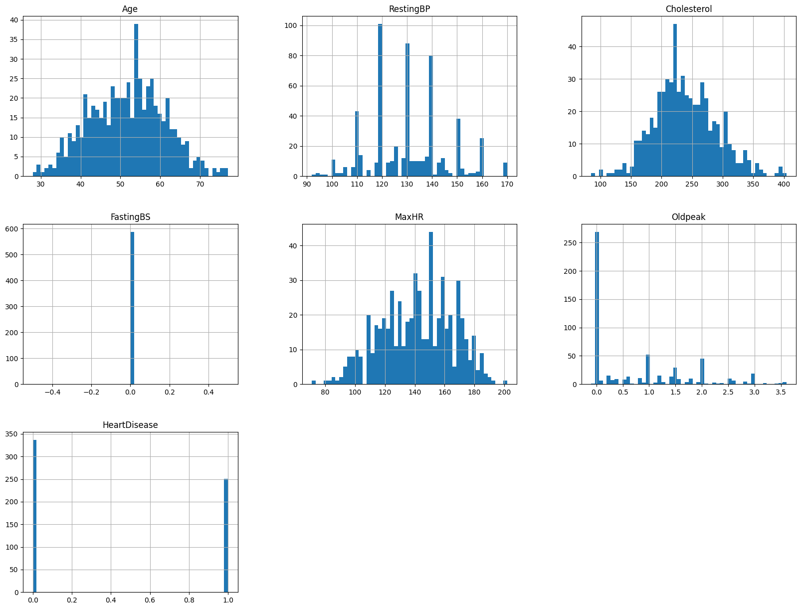

# Prediksi Penyakit Gagal Jantung - Rizky Aditya
Proyek ini dibuat sebagai bahan latihan dalam kursus Machine Learning Terapan dari Dicoding

## Domain Proyek
### Latar Belakang
Penyakit Kardiovaskular (CVD) merupakan penyebab utama kematian di Asia [1] dan juga merupakan penyebab utama kematian di dunia. Penyakit ini menyebabkan
sekitar 17,9 juta kematian setiap tahun, yang menyumbang 31 persen dari seluruh kematian di dunia. Empat dari 5 kematian akibat kardiovaskular disebabkan oleh
serangan jantung dan stroke, dan sepertiga dari kematian tersebut terjadi pada orang dibawah usia pada 70 Tahun. salah satu kejadian umum yang disebabkan oleh
Kardiovaskular adalah Gagal Jantung [2].  

Orang-orang yang mengalami penyakit kardiovaskular membutuhkan deteksi dini untuk mencegah kemungkinan akibat fatal yang disebabkan oleh penyakit ini. Oleh karena itu, diperlukan pengembangan algoritma pembelajaran mesin yang dapat membantu dalam mendeteksi dini penyakit kardiovaskular dan masalah pada jantung.

### Referensi
[1] Zhao, D. (2021). Epidemiological features of cardiovascular disease in Asia. JACC: Asia, 1(1), 1-13.  
[2] https://www.kaggle.com/datasets/fedesoriano/heart-failure-prediction

## Business Understanding
Proyek ini melibatkan pemahaman mendalam tentang dampak penyakit kardiovaskular dan gagal jantung terhadap kesehatan masyarakat. Penyakit dengan
tingkat kematian tinggi ini membutuhkan deteksi dini serta pengelolaan yang efektif. Dengan demikian, proyek ini bertujuan untuk menggunakan
pendekatan pembelajaran mesin (Machine Learning) untuk memprediksi kemungkinan terjadinya penyakit gagal jantung berdasarkan data klinis pasien.

### Problem Statement
1. Bagaimana mengembangkan model prediksi berbasis machine learning untuk penyakit gagal jantung?.
2. Bagaimana mengevaluasi model dan memilih model terbaik pembelajaran mesin untuk memprediksi risiko penyakit gagal jantung?.

### Goals
1. Mengembangkan model prediksi yang dapat mengidentifikasi individu dengan risiko tinggi terkena penyakit gagal jantung.
2. Mengevaluasi kinerja model menggunakan metrik evaluasi yang sesuai untuk memastikan akurasi dan keandalan model.

### Solution Statements
1. Mengimplementasikan algoritma KNN, Logistic Regression dan Decision Tree untuk membangun model prediksi penyakit gagal jantung.
2. Melakukan pemrosesan data yang sesuai, termasuk penskalaan fitur dan penanganan missing value dan outlier (jika ditemukan).
3. Melakukan pelatihan model menggunakan kedua algoritma dengan menggunakan data yang sudah dipisah menjadi data latih dan data uji.
4. Mengevaluasi kinerja kedua model dengan metrik evaluasi seperti akurasi, presisi, recall, dan f1 score.

## Data Understanding
Proyek ini menggunakan dataset 'Heart Failure Prediction' yang dapat diunduh di [link berikut](https://www.kaggle.com/datasets/fedesoriano/heart-failure-prediction)
### Berikut Informasi-Informasi yang terdapat dalam dataset :
- Dataset Memiliki Format CSV (Comma-Separated Values).
- Dataset memiliki 918 data observasi dengan 12 Features.
- Tidak ada Missing Values dan duplikasi dalam Dataset

### Variabel-Variabel yang terdapat dalam Dataset :
1. **Age** : Usia Pasien Dalam Tahun.
2. **Sex** : Jenis Kelamin Pasien (M : Male/Laki-Laki, F : Female/Perempuan).
3. **ChestPainType** : Jenis Nyeri dada yang dialami pasien (TA : Angina Tipikal, ATA : Angina Atipikal, NAP : Nyeri Dada Non Anginal, ASY : Asimtomatik).
4. **RestingBp** : Tekanan darah istirahat pasien dalam satuan mm Hg (milimeter air raksa)
5. **Cholestrol** : Kolestrol serum pasien dalam satuan mm/dl.
6. **FastingBS** : Kadar gula darah puasa pasien [1: Jika FastingBS>120 mg/dl, 0: sebaliknya].
7. **RestingECG** : Hasil elektrokardiogram istirahat pasien (Normal: Normal, ST: Abnormalitas gelombang ST-T (Inversi gelombang T dan/atau elevasi atau depresi ST > 0.05 mV), LVH: Kemungkinan atau pasti hipertrofi ventrikel kiri menurut kriteria Estes)
8. **MaxHR** : Denyut jantung maksimum yang dicapai oleh pasien (Nilai Numerik antara 60 dan 202)
9. **ExerciseAngina** : Angina yang dipicu oleh latihan (Y : Ya, N : Tidak)
10. **Oldpeak** : Depresi segmen T (Nilai numerik diukur dalam depresi)
11. **ST_Slope** : Kemiringan segmen ST latihan puncak (Up : Naik, Flat : Datar, Down : Turun)
12. **HeartDisease** : Kelas keluaran (1: memiliki penyakit jantung, 0 : Normal)

### Identifikasi Outlier Menggunakan Boxplot
identifikasi outlier dilakukan untuk menganalisa outlier dalam setiap fitur numerik dalam dataset. penggunaan boxplot dapat memungkinkan kita
untuk visualisasi distribusi nilai dalam setiap fitur dan identifikasi adanya nilai ekstrim atau outlier.

Proses analisa menemukan beberapa outlier dari fitur numerikal dalam data, langkah yang dilakukan adalah menghapus seluruh data
dengan outlier sehingga dimensi data kini berubah menjadi **588 Data Diagnosa** dengan **12 Fitur**

### Univariate Analisis
Tahap ini merupakan tahap untuk menganalisa fitur secara terpisah
**Analisa Setiap Fitur Kategori**
berikut merupakan visualisasi sebaran data setiap fitur kategori, termasuk visualisasi sebaran data target
1. Distribusi Berdasarkan Jenis Kelamin  

2. Distribusi Berdasarkan Kategori Chest Pain Type  

3. Distribusi Berdasarkan Kategori restingecg  

4. Distribusi Berdasarkan Kategori st slope  

5. Distribusi Berdasarkan Kategori Exercise Angina  

6. Distribusi Berdasarkan Target Variabel  
Keterangan :  
1 -> Mengalami risiko penyakit gagal jantung  
0 -> Tidak mengalami  

**Analisa Sebaran Fitur Numerik**
  
dalam grafik sebaran fitur numerik diatas, dapat dipastikan fitur-fitur numerik sudah memiliki distribusi yang cukup baik setelah menghapus beberapa outlier

## Data Preparation

- Label Encoder
  Label Encoder adalah teknik pemrosesan data untuk data kategorikal, Tujuannya adalah untuk mengubah nilai-nilai dalam satu atau lebih pada kolom
  kategorikal menjadi numerik. Firut yang diubah menjadi numerik dalam proyek ini adalah fitur Sex, ChestPainType, FastingBS, RestingECG, ExerciseAngina, dan ST_Slope
- Normalisasi
  Algoritma machine learning akan memiliki performa lebih baik dan cepat jika dimodelkan dengan data seragam yang memiliki skala relatif sama. Salah satu teknik normalisasi 
  yang digunakan pada proyek ini adalah Standarisasi dengan MinMaxScaler dari sklearn.preprocessing
- Train Test Split
  Proses ini membagi data menjadi data latih dan data uji. Data latih akan digunakan untuk membangun model, sedangkan data uji akan digunakan untuk menguji hasil performa
  prediksi model. Proyek ini akan membagi dataset menjadi 470 data latih dan 118 data uji

## Modelling
Algoritma yang digunakan dalam pengerjaan proyek ini adalah K-Nearest Neighbor, Logistic Regression, dan Decision Tree
1. K-Nearest Neighbor (KNN)
   Algoritma sederhana ini mengklasifikasikan objek berdasarkan mayoritas label dari tetangga terdekatnya dalam ruang fitur. Ketika Algoritma KNN menerima fitur baru,
   ia akan mencari titik titik data terdekat yang telah ditentukan sebelumnya (Hyperparameter K) dan memberikan label mayoritas dari tetangga-tetangga tersebut kepada
   titik data baru
   Dalam model Klasifikasi pada proyek ini, Hyperparameter K yang digunakan adalah (K=3)
   K-Nearest Neighbor memiliki kelebihan sederhana dan mudah diimplementasikan, dan tidak memerlukan asumsi tertentu tentang distribusi data. kelemahan algoritma ini
   adalah Sensitif terhadap skala dan dimensi fitur, dan komputasi lambar ketika memprediksi dataset yang besar.
   Tahapan pemodelan KNN dalam proyek ini menggunakan model KNeighborsClassifier yang ada dalam sklearn.neighbors
3. Logistic Regression
   Logistic Regression adalah algoritma yang umum digunakan untuk klasifikasi. Meskipun namanya mengandung "regression", Logistic Regression sebenarnya digunakan untuk masalah   
   klasifikasi biner. Algoritma ini memodelkan probabilitas bahwa output adalah sukses dalam hal nilai-nilai fitur inputnya.
   Kelebihan Logistic Regression adalah Mudah diinterpretasikan dan dapat memberikan pemahaman yang baik tentang hubungan antara variabel independen dan variabel target. namun
   kekurangannya adalah memerlukan asumsi yang kuat tentang distribusi data.
   Tahapan pemodelan Logistic Regression dalam proyek ini menggunakan Model LogisticRegression yang ada dalam sklearn.linear_model
5. Decision Tree
   Decision Tree adalah algoritma pembelajaran mesin yang menggunakan struktur pohon untuk membuat keputusan berdasarkan serangkaian aturan. Pada setiap node dalam pohon, keputusan
   dibuat berdasarkan nilai fitur tertentu. Setiap cabang pada pohon mewakili pilihan untuk nilai fitur tersebut, dan setiap daun mewakili label kelas atau nilai prediksi.
   kelebihan algoritma ini adalah mudah dimengeri dan direpresentasikan, dan dapat menangani data kategori dan numerik. namun rentan terhadap overfitting apalagi pada data yang kompleks.
   tahapan pemodelan decision tree dalam proyek ini menggunakan model DecisionTree yang ada dalam sklearn.tree

## Evaluation
Metrik Evaluasi yang digunakan dalam proyek ini adalah akurasi dan confussion matrix menggunakan precision, recall, dan F1 Score. Yang mana akurasi menentukan tingkat kemiripan antara hasil prediksi dengan nilai yang sebenarnya.
Confusion Matrix adalah tabel yang menyatakan klasifikasi jumlah uji yang benar dan jumlah uji yang salah Confusion Matrix sendiri memiliki empat istilah :
1.	True Negative (TN) yang berarti model klasifikasi memprediksi data ada di kelas negative namun yang sebenarnya data memang ada di kelas negative.
2.	True Positive (TP) yang berarti model klasifikasi memprediksi data ada dikelas positif namun sebenarnya memang data berada di kelas positif.
3.	False Negative (FN) yang berarti model klasifikasi memprediksi data ada di kelas negative namun yang sebenarnya data ada di kelas positif.
4.	False Positive (FP) yang berarti model klasifikasi memprediksi data ada di kelas positif namun yang sebenarnya data ada di kelas negative. 
  
Precision adalah perbandingan antara True Positive (TP) dengan banyaknya data yang diprediksi positif, secara matematis dapat dilihat dibawah ini
  
Precision=  TP/(TP+FP)
  
Untuk recall sendiri adalah perbandingan antara true positive (TP) dengan banyaknya data yang sebenarnya positif. Dapat dinyatakan secara matematis seperti dibawah ini  
  
Recall=  TP/(TP+FN)  
  
Sedangkan F1 Score adalah nilai tengah dari precision dan recall. Nilai terbaik dari F1 Score adalah 1 dan nilai terburuknya adalah 0, secara matematis dapat dituliskan seperti dibawah ini  
  
  1/F1=  1/2 (1/precision+ 1/recall) 
    
Nilai F1 Score yang baik menandakan bahwa model klasifikasi kita punya precision dan recall yang baik  

berikut merupakan hasil evaluasi matrix antara ketiga model yang digunakan

### Kesimpulan
1. K-Nearest Neighbor (KNN):
- Akurasi pada data uji sebesar 0.771 dan pada data latih sebesar 0.904, menunjukkan bahwa model memiliki kinerja yang baik dalam melakukan klasifikasi.
- Precision, recall, dan F1 score juga cukup baik, meskipun tidak sebaik akurasi. Hal ini menunjukkan bahwa model KNN mampu mengklasifikasikan gagal jantung dengan baik namun dengan beberapa kekurangan dalam mengidentifikasi true positives.
- Model ini memiliki kinerja yang stabil antara data uji dan data latih.
2. Logistic Regression:
- Akurasi pada data uji sebesar 0.805 dan pada data latih sebesar 0.864, menunjukkan bahwa model juga memiliki kinerja yang baik dalam melakukan klasifikasi.
- Precision, recall, dan F1 score yang relatif tinggi menunjukkan bahwa model Logistic Regression mampu mengklasifikasikan gagal jantung dengan baik, dan mungkin lebih baik daripada KNN dalam hal ini.
- Model ini juga memiliki kinerja yang stabil antara data uji dan data latih.
3. Decision Tree:
- Meskipun memiliki akurasi yang cukup tinggi pada data latih (1.000), akurasi pada data uji hanya sebesar 0.746. Hal ini menunjukkan kemungkinan adanya overfitting pada model terhadap data latih, yang menyebabkan performa yang buruk pada data uji.
- Precision, recall, dan F1 score pada data uji juga menunjukkan kinerja yang lebih rendah dibandingkan dengan KNN dan Logistic Regression.
- Model Decision Tree cenderung tidak generalisasi dengan baik terhadap data yang tidak terlihat sebelumnya.

Dari hasil tersebut, dapat disimpulkan bahwa model Logistic Regression mungkin merupakan pilihan terbaik di antara ketiga model untuk mengklasifikasikan risiko penyakit gagal jantung berdasarkan performa yang stabil dan tinggi pada data uji. Model KNN juga memiliki kinerja yang baik dan stabil, sementara model Decision Tree menunjukkan tanda-tanda overfitting dan tidak baik terhadap data baru.
